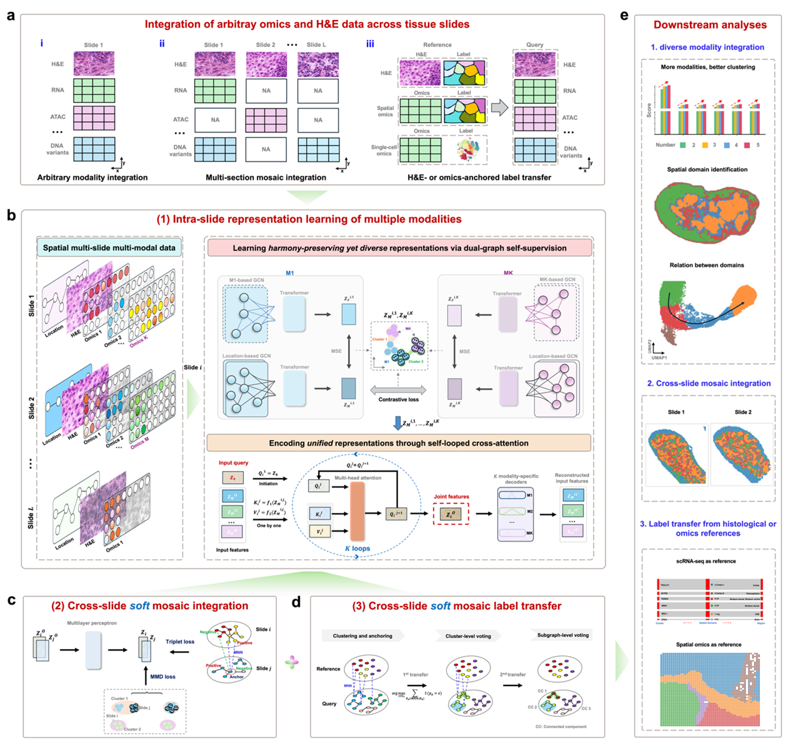

# stMixer

stMixer is a research framework for scalable mosaic integration and label transfer in spatial histology and multi-omics data.



## Overview

stMixer is designed for three related spatial analysis settings:

1. Intra-slide multi-modal integration for spatial domain identification.
2. Cross-slide mosaic integration for aligning partially overlapping sections.
3. Cross-slide label transfer using omics or histology as the anchoring modality.

According to the manuscript, the method combines:

- Dual-graph self-supervision to learn modality-aware representations.
- Self-looped cross-attention to fuse histology, molecular, and spatial signals.
- Triplet loss and MMD loss for cross-slide alignment.
- Graph-guided cluster voting for anatomically coherent label transfer.

## Repository Status

This repository currently provides the research scripts used for the stMixer study. It is organized by analysis task rather than as a packaged Python library.

At this stage, the repository is most suitable for:

- Reading the implementation used in the manuscript.
- Reproducing the main workflows with prepared local datasets.
- Adapting the scripts to related spatial multi-omics projects.

## Repository Structure

```text
stMixer/
├── dataset/
│   ├── h&e_emb/
│   │   ├── test_tiling.py
│   │   └── test_emb.py
│   └── readme.txt
├── intra-slice_integration/
│   ├── configurations.py
│   ├── main.py
│   ├── sc_dataset.py
│   └── scnet.py
├── label_transfer/
│   └── test.py
├── mosaic_integration/
│   └── test.py
├── fig1.png
└── readme.txt
```

Task-level entry points:

- `stMixer/intra-slice_integration/main.py`: train intra-slide representations from paired spatial modalities.
- `stMixer/mosaic_integration/test.py`: align embeddings across two slides for mosaic integration.
- `stMixer/label_transfer/test.py`: transfer labels across slides after embeddings are prepared.
- `stMixer/dataset/h&e_emb/test_tiling.py`: generate local and global image tiles for H&E-based workflows.
- `stMixer/dataset/h&e_emb/test_emb.py`: extract H&E image embeddings.

## Installation

### 1. Create a Python environment

```bash
conda create -n stMixer python=3.8.20 -y
conda activate stMixer
```

### 2. Install PyTorch

Install the PyTorch stack that matches your CUDA version. The experiments in this repository were developed with:

- `torch==2.4.1`
- `torchvision==0.19.1`
- `torchaudio==2.4.1`

For CUDA 12.1, an example installation is:

```bash
pip install torch==2.4.1 torchvision==0.19.1 torchaudio==2.4.1 --index-url https://download.pytorch.org/whl/cu121
```

If you are using CPU only or a different CUDA version, please follow the official PyTorch installation guide and then continue with the next step.

### 3. Install the remaining dependencies

```bash
pip install -r requirements.txt
```

Main dependencies used in this repository include:

- `torch-geometric==2.6.1`
- `torch_cluster==1.6.3`
- `torch_scatter==2.1.2`
- `scanpy==1.9.8`
- `anndata==0.9.2`
- `numpy==1.24.4`
- `pandas==2.0.3`
- `scipy==1.10.1`
- `scikit-learn==1.3.2`
- `scikit-misc==0.2.0`
- `matplotlib==3.6.3`
- `tqdm==4.67.0`
- `umap-learn`
- `harmonypy`
- `esda`
- `seaborn`
- `psutil`
- `networkx`

## Data Preparation

stMixer was benchmarked on simulated data and several real spatial datasets spanning RNA, protein, ATAC, and histology.

Datasets mentioned in the manuscript:

- Human lymph node from SpatialGlue.
- Mouse thymus from Stereo-CITE-seq.
- Mouse brain spatial ATAC-RNA-seq from `GSE205055`.
- Mouse spleen SPOTS data from `GSE198353`.
- Human breast cancer Visium slides from 10x Genomics.
- Mouse brain scRNA-seq reference from `SRP135960`.

Please see [stMixer/dataset/readme.txt](stMixer/dataset/readme.txt) for a practical summary of expected inputs.

## Expected Inputs

The current scripts assume that data have already been preprocessed into local `h5ad` files or `npy` arrays.

Typical required inputs include:

- Spatial coordinates in `adata.obsm["spatial"]`.
- A low-dimensional feature matrix in `adata.X` or `adata.obsm["feat"]`.
- Optional annotation columns in `adata.obs`.
- Optional histology tile paths in `adata.obs["local_tile_path"]` and `adata.obs["global_tile_path"]`.

For histology-based workflows, the repository includes helper scripts for:

- Spot-level tile extraction.
- H&E embedding generation.

## Usage

The repository is currently script-based. A typical workflow is:

### 1. Intra-slide integration

Prepare paired modalities for a single slide, then run:

```bash
cd stMixer/intra-slice_integration
python main.py --expName demo --gpuID 0
```

This stage learns slide-specific embeddings and saves intermediate outputs for downstream analysis.

### 2. Mosaic integration

After preparing slide-level embeddings for two sections, run:

```bash
cd stMixer/mosaic_integration
python test.py
```

This stage aligns embeddings across slides using triplet and MMD-based optimization.

### 3. Label transfer

After preparing query/reference embeddings and annotations, run:

```bash
cd stMixer/label_transfer
python test.py
```

This stage transfers labels by combining embedding similarity with cluster-level voting and spatial refinement.

## Important Notes Before Running

- The current repository contains research scripts rather than a fully parameterized command line package.
- Several scripts expect local file paths to be filled in before execution.
- Input file formats should match the examples used in the manuscript workflows.
- Histology embedding scripts rely on external image assets and local pretrained checkpoints.

If you are starting from a fresh dataset, it is usually easiest to first match your input files to the structures described in [stMixer/dataset/readme.txt](stMixer/dataset/readme.txt).

## Manuscript Summary

In the manuscript, stMixer was used to:

- Integrate two to five simulated omics modalities.
- Identify spatial domains in human lymph node and mouse thymus.
- Recover transitional states in thymus and fine-grained structures in mouse brain.
- Align multi-slide mouse spleen sections under shared and mosaic settings.
- Transfer labels across Visium breast cancer slides and between single-cell and spatial references.

## Citation

If you use this repository, please cite the stMixer manuscript:

## Contact

